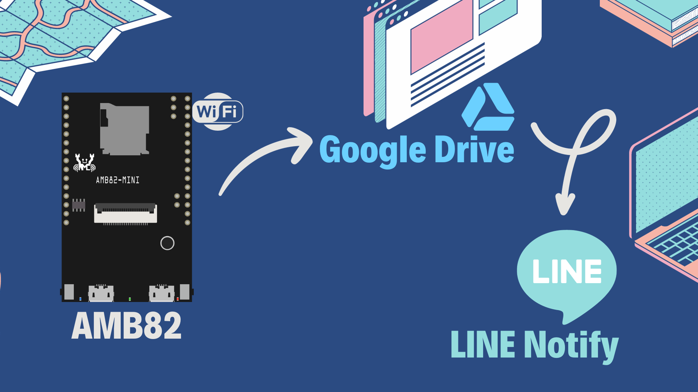

# AMB82 Camera Backup System



AMB82 is an innovative system that seamlessly captures images using its onboard camera, saves them directly to an SD card, and later backs up the captured images on Google Drive. Additionally, the system is integrated with Line Notify to keep you informed about its status.

 

## Features

 

- **Onboard Camera Capturing:** Utilizes the onboard camera for high-resolution image captures.
- **SD Card Storage:** Directly saves the captured images onto an SD card for immediate access.
- **Google Drive Backup:** Ensures long-term storage and easy access by backing up images to Google Drive.
- **Line Notify Integration:** Receive notifications about the system's status directly on Line.

 

## Setup

 

1. **Prerequisites:**
   - Ensure that you have the required libraries installed.
   - Google Drive API credentials.
   - Line Notify token.

 

2. **Installation:**
   ```bash
   git clone https://github.com/your_username/AMB82_Camera_Backup_System.git
   cd AMB82_Camera_Backup_System
   pip install -r requirements.txt
   ```

 

3. **Configuration:**
   - Update the `config.yaml` file with your Google Drive API credentials and Line Notify token.

 

4. **Usage:**
   ```bash
   python main.py
   ```

 

## Contribution

 

Contributions are always welcome! Please read the [contribution guidelines](CONTRIBUTING.md) first.

 

## License

 

This project is licensed under the MIT License - see the [LICENSE.md](LICENSE.md) file for details.

 
